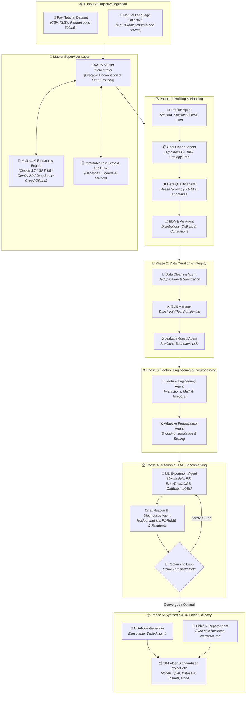

# 🧠 Autonomous AI Data Scientist (AADS)

<div align="center">

[](https://autonomous-data-science-ai-agent.streamlit.app/)
[](https://react.dev/)
[](https://fastapi.tiangolo.com/)
[](https://www.python.org/)
[](https://python.langchain.com/)
[](LICENSE)

**An Agentic AI Data Scientist that autonomously transforms raw tabular datasets and natural-language objectives into full-lifecycle, production-ready, reproducible Machine Learning projects.**

🚀 **Live Web Application**: [https://autonomous-data-science-ai-agent.streamlit.app/](https://autonomous-data-science-ai-agent.streamlit.app/)

</div>

---

## 📌 Table of Contents
- [✨ Key Features](#-key-features)
- [🤖 Agentic Multi-Agent Architecture](#-agentic-multi-agent-architecture)
- [🛠️ Tech Stack](#️-tech-stack)
- [🎨 Modern UI & Experience](#-modern-ui--experience)
- [🚀 Live Demo & How to Use](#-live-demo--how-to-use)
- [📦 Standardized 10-Folder Artifact Contract](#-standardized-10-folder-artifact-contract)
- [⚙️ Local Installation & Quickstart](#️-local-installation--quickstart)
- [🛡️ Guardrails & Core Principles](#️-guardrails--core-principles)
- [📄 License](#-license)

---

## ✨ Key Features

- 🧠 **Autonomous Decision-Making**: Coordinates 14+ specialist agents to profile, clean, engineer features, benchmark ML models, and generate analytical executive reports without manual intervention.
- 🌐 **Multi-Provider LLM Intelligence**: Pluggable agent reasoning powered by **OpenRouter, Google Gemini, Anthropic Claude, OpenAI, Groq, or Ollama (Local)** with dynamic searchable model discovery.
- ⚡ **Dual Execution Engines (AI vs Local)**:
  - **✨ AI-Powered Agentic Mode**: Uses LLM cognition to reason over edge cases, formulate strategic analytical plans, and write custom diagnostic interpretations.
  - **💻 Local (Deterministic) Mode**: Fully offline, rule-based, deterministic pipeline executing instantly without external API keys.
- 🛡️ **Zero Data-Leakage Guarantee**: Enforces rigorous train/val/test boundary guards before scaling and encoding transformations.
- 🏆 **Comprehensive Model Leaderboard**: Evaluates 10+ candidate algorithms (RandomForest, ExtraTrees, GradientBoosting, XGBoost, CatBoost, LightGBM, Linear/Logistic models) with multi-metric ranking and download capabilities.
- 🔍 **Interactive Dataset Exploration**: Instant dataset previews with collapsible accordion viewers and authentic raw feature casing preservation.
- 📦 **1-Click Full Project Export**: Exports a self-contained `.ZIP` bundle containing cleaned CSVs, serialized model weights (`.pkl`), an interactive validated Jupyter Notebook (`.ipynb`), high-res EDA charts (`.png`), and executive markdown reports (`.md`).
- 📁 **High-Capacity Dataset Uploads**: Supports CSV, XLSX, and Parquet uploads with support for up to 500 MB datasets.

---

## 🤖 Agentic Multi-Agent Architecture

AADS is built on a **Supervisor–Specialist Agentic Pattern**, where a central Orchestrator manages specialized autonomous workers through every phase of the data science lifecycle:



### 👥 The Specialist Agents:
1. **Goal Planner Agent**: Deconstructs natural language user goals into structured hypotheses and analytical roadmaps.
2. **Profiler Agent**: Inspects dataset shapes, types, sparsity, skewness, and cardinality.
3. **Data Quality Agent**: Calculates holistic data health scores (0-100) and detects anomalies.
4. **EDA Agent**: Generates publication-grade distribution, correlation, and categorical visualization plots.
5. **Cleaning Agent**: Sanitizes null values, fixes types, and eliminates duplicates with transparent audit logs.
6. **Split Manager**: Partitions data into strictly separated Train, Validation, and Test holdouts.
7. **Leakage Guard**: Validates zero feature overlap or target leakage across partitions.
8. **Feature Engineering Agent**: Synthesizes interaction terms, polynomial features, and domain-specific indicators.
9. **Preprocessing Agent**: Applies adaptive one-hot / target encoding, imputation, and feature scaling.
10. **ML Experiment Agent**: Trains candidate algorithms and maintains comprehensive benchmark rankings.
11. **Evaluation Agent**: Computes holdout metrics (F1, ROC-AUC, RMSE, MAE, R²) and residual diagnostics.
12. **Replanning Agent**: Iteratively refines modeling strategies based on validation feedback.
13. **Notebook Generator Agent**: Auto-synthesizes a standalone, executable, reproducible `.ipynb` notebook.
14. **Chief AI Report Agent**: Synthesizes in-depth business narratives and strategic recommendations.

---

## 🛠️ Tech Stack

### 🧠 Agentic AI & LLM Orchestration
- **LangChain / LangChain Core**: Standardized prompt formatting, messaging, and multi-provider agent interfaces.
- **Multi-LLM Provider Engine**: Zero-dependency direct integration with **OpenRouter, Anthropic Claude 3.7 / 3.5, OpenAI GPT-4.5 / GPT-4o, Google Gemini 2.0, DeepSeek, Groq, and Ollama**.
- **Pydantic & Pydantic-Settings v2**: Robust type validation, state schemas, and environment configuration.

### 📊 Machine Learning & Data Engines
- **Scikit-Learn**: Core ML algorithms, pipelines, cross-validation, and metrics evaluation.
- **XGBoost, CatBoost, LightGBM**: State-of-the-art gradient boosted decision trees.
- **Pandas, Polars, PyArrow, OpenPyXL**: High-performance multi-engine tabular processing.
- **DuckDB**: Fast in-process analytical SQL queries.

### 🎨 Frontend UI & Visualization
- **React 18 + Vite**: High-performance single-page app with floating navbar, real-time pipeline visualizer, and artifact manager.
- **Deep Black & Radiant Royal Purple Design System**: Modern dark-mode aesthetic with ambient purple glows, frosted double-bezel cards, and responsive micro-interactions.
- **FastAPI (Async Backend)**: High-speed ASGI REST API and Server-Sent Events (SSE) log streaming.
- **Streamlit**: Classic interactive web dashboard.
- **Plotly & Matplotlib**: Interactive and high-res static diagnostic visualizations.

---

## 🎨 Modern UI & Experience

AADS offers a **React 18 + Vite** web interface powered by a **FastAPI backend**:
- **Radiant Purple Aesthetic**: Built with deep obsidian surfaces (`#05020c`), radiant purple lighting, and frosted glass components.
- **Real-Time Pipeline Stepper**: Live tracking of all 8 pipeline phases with elapsed timers, progress percentages, and streaming audit logs.
- **Frontier Model Combobox**: Search, type, or pick top frontier models with instant keyboard navigation.
- **Dedicated Artifact Explorer**: In-browser tabs for inspecting EDA visuals, model leaderboards, data quality scores, and full project downloads.

---

## 🚀 Live Demo & How to Use

Try the live web application here:
🔗 **[https://autonomous-data-science-ai-agent.streamlit.app/](https://autonomous-data-science-ai-agent.streamlit.app/)**

### 3-Step Workflow:
1. **Upload Dataset / Pick Sample**: Upload your CSV, Excel, or Parquet dataset (or choose the built-in Customer Churn dataset).
2. **Define Goal**: Enter your goal in natural English (e.g. *"Predict customer churn, discover key behavioral drivers, and export top models"*).
3. **Execute & Download**: Run the autonomous pipeline and download the full 10-folder project archive with all trained models, charts, and notebooks.

---

## 📦 Standardized 10-Folder Artifact Contract

Every run creates a standardized, reproducible project directory:

```
Generated_Project_<RUN_ID>/
├── 01_Raw_Data/                 # Immutable copy of raw uploaded data
├── 02_Cleaned_Data/             # Sanitized and type-validated dataset
├── 03_Feature_Engineered_Data/  # Domain interactions and engineered features
├── 04_ML_Ready_Data/            # Imputed, scaled, and encoded ML matrices
├── 05_Notebook/                 # Standalone, validated Jupyter Notebook (.ipynb)
├── 06_Models/                   # Serialized top model artifacts (.pkl) & metadata
├── 07_Visualizations/           # High-resolution EDA and diagnostic charts
├── 08_Reports/                  # Chief AI Scientist executive summaries (.md / .json)
├── 09_Experiments/              # Full candidate experiment benchmark logs (.csv)
└── 10_Metadata/                 # Complete agent execution state history (.json)
```

---

## ⚙️ Local Installation & Quickstart

### Prerequisites
- Python 3.10 or higher
- Node.js 18+ and npm (for React UI)

### 1. Clone & Setup Python Environment
```bash
git clone https://github.com/PiyushAnand2006/Autonomous_Data_Science_AI_Agent.git
cd Autonomous_Data_Science_AI_Agent

# Create and activate virtual environment
python -m venv .venv

# On Windows:
.venv\Scripts\activate
# On macOS/Linux:
# source .venv/bin/activate

# Install dependencies
pip install -r requirements.txt
```

### 2. Option A: Run Full-Stack React + FastAPI App (Recommended)
```bash
# Terminal 1 — Start the FastAPI Backend (Port 8000)
python -m uvicorn aads.api.server:app --port 8000

# Terminal 2 — Start the Vite React Frontend (Port 5173)
cd frontend
npm install
npm run dev
```
Open **[http://localhost:5173](http://localhost:5173)** in your browser.

### 3. Option B: Run Streamlit App
```bash
streamlit run aads/app/streamlit_app.py
```
Open **[http://localhost:8501](http://localhost:8501)** in your browser.

---

## 🛡️ Guardrails & Core Principles

- **Data Immutability**: The original raw dataset is treated as read-only and preserved untouched in `01_Raw_Data/`.
- **Strict Leakage Prevention**: Transformers and scalers are fitted strictly on training partitions to ensure zero data leakage.
- **Auditability**: Every decision, imputation rationale, and feature selection is recorded in `10_Metadata/run_state.json`.

---

## 📄 License

This project is open-source and licensed under the [MIT License](LICENSE).
